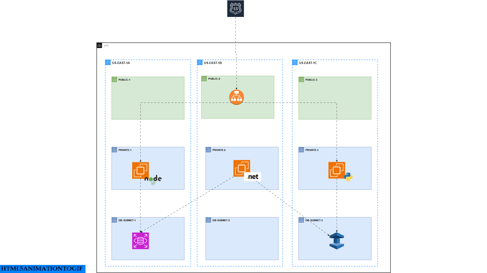

This is an extension of the e-voting application that will be deployed on EC2 instances, with each microservice running on a separate EC2 instance.

## Flow of Execution

- Create a VPC with 3 public subnets, 3 private subnets, and 3 DB subnets.
- Create security groups for the services and assign specific IAM permissions.
- Create 5 EC2 instances: one for each service. The result and vote services will be in public subnets, while the worker app, Postgres, and Redis will be in private subnets. These will be bootstrapped with user-data scripts.
- Create a bastion host to access private servers running in private subnets.
- Log into each server.
- Clone the repository and add the Docker Compose file along with the required environment variables.
- Create a private hosted zone in Route 53 to map service names to private IPs for Redis and Postgres.
- Run `docker compose up`.
- Verify by casting votes.

## Architecture Diagrams

Below are the architecture diagrams in order:

### 1.Application Workflow

### 2.VPC-DESIGN

### 3. User Workflow

