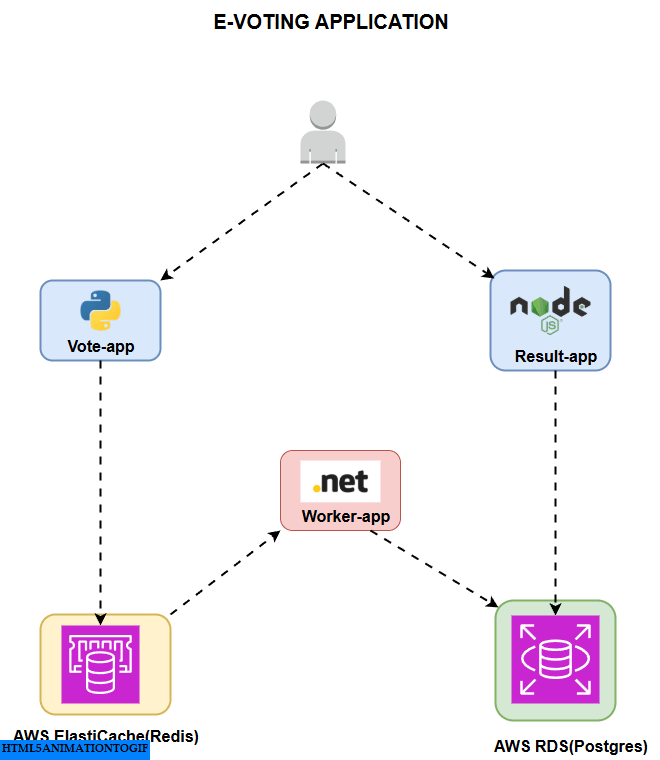
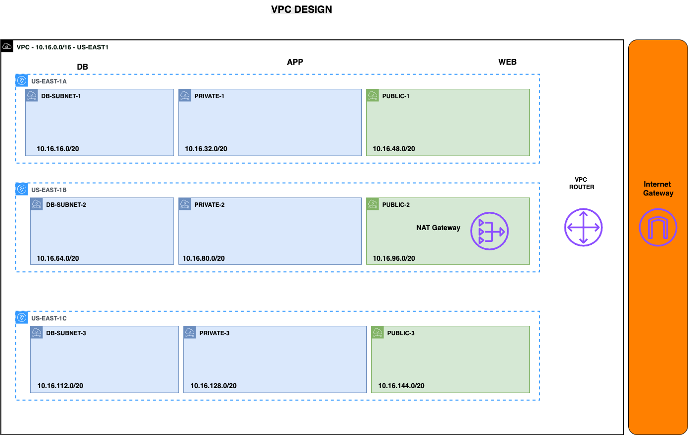
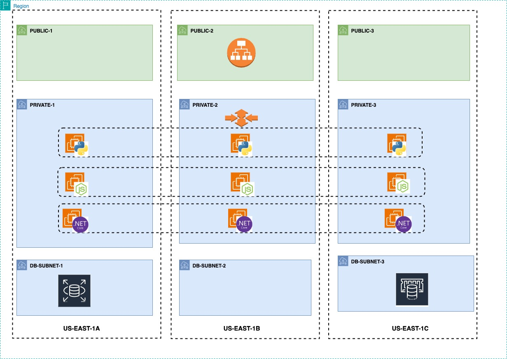

# Stage 1: Deploying an Elastic and Scalable Three-Tier Web Application on AWS

This stage demonstrates the deployment of a three-tier e-voting application with elastic scaling capabilities using AWS services. The application is designed to handle varying loads automatically while maintaining high availability.

## Architecture Overview

This implementation showcases a production-ready three-tier architecture:
- **Presentation Tier**: Load-balanced web interfaces
- **Application Tier**: Auto-scaling application servers
- **Data Tier**: Managed database and caching services

## AWS Services Used

| Service | Purpose |
|---------|---------|
| **VPC** | Network isolation and security |
| **EC2** | Application hosting |
| **Elastic Load Balancer (ELB)** | Traffic distribution and high availability |
| **Auto Scaling Group (ASG)** | Automatic capacity management |
| **Route 53** | DNS management and routing |
| **AWS Systems Manager Parameter Store** | Secure configuration management |
| **Amazon RDS** | Managed relational database |
| **Amazon ElastiCache** | In-memory caching |

## Prerequisites

Before starting, ensure you have:
- Basic Linux knowledge
- Basic understanding of AWS services
- Understanding of Docker and containers
- AWS CLI configured with appropriate permissions

## Deployment Steps

### 1. Set up Networking
Create a VPC with:
- **3 private subnets** for the database tier
- **3 private subnets** for the application tier  
- **3 public subnets** for the web/presentation tier

### 2. Configure Security
- Create Security Groups for the various tiers and applications
- Implement principle of least privilege access

### 3. Provision Databases and Caching
- Create an **Amazon RDS instance** for the database tier
- Create an **Amazon ElastiCache (Redis)** cluster for caching

### 4. Deploy the Application Manually (First Instance)
- Launch one EC2 instance manually
- Install Docker and required components
- Deploy one of the applications and connect it to RDS/Redis to validate connectivity

### 5. Automate with User Data
- Use **EC2 User Data scripts** to automate installation and deployment for subsequent instances
- Ensure consistent deployment across all instances

### 6. Create Launch Template & Auto Scaling
- Create a **Launch Template** for the application tier
- Configure an **Auto Scaling Group (ASG)** and attach it to a Target Group
- Set scaling policies based on CPU utilization and request count

### 7. Set Up Load Balancing
- Create an **Internet-facing Elastic Load Balancer**
- Configure routing rules:
  - `/result` → Result application
  - `/vote` → Vote application

### 8. Enable HTTPS
- Use **AWS Certificate Manager** to issue SSL/TLS certificates for both domains (result and vote)
- Configure HTTPS on the Load Balancer for secure communications

### 9. Configure DNS
- In **Route 53**, create records for the two domains
- Point them to the Load Balancer DNS name using CNAME records

## What You'll Learn

By completing this stage, you'll understand how to:

- Design and deploy a **three-tier architecture** on AWS
- Secure and scale applications using **EC2, ASG, and ELB**
- Automate deployments with **User Data scripts**
- Integrate **RDS and ElastiCache** into your application
- Configure custom domains and HTTPS using **Route 53 and Certificate Manager**
- Build an application setup that is **elastic, scalable, and production-ready**

## Architecture Diagrams

The following diagrams illustrate the application architecture and deployment strategy:

### 1. Application Workflow

### 2. VPC Design

### 3. User Workflow

## Related Resources

- [Main E-Voting Application Repository](https://github.com/isrealei/e-voting-applcation)

